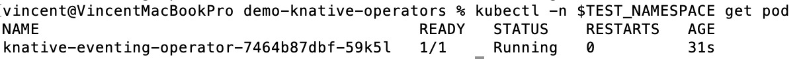
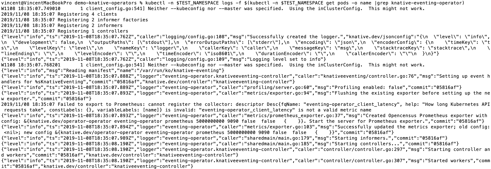
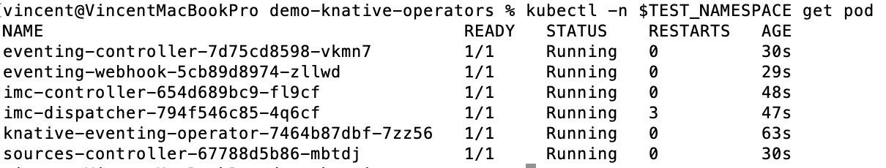
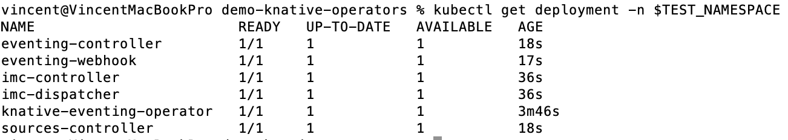

# Demo of basic features for Knative Eventing Operator

You can find the official released artifacts of Knative Eventing Operator at the [release page](https://github.com/knative/eventing-operator/releases).
The latest release is v0.10.0.

## Demo Video

To view the full video of the demo of basic features of Knative Eventing Operator, click on the following video:
[](http://www.youtube.com/watch?v=E-3fwOKtT-w "")

## Create a test namespace for eventing operator

We use the namespace test-eventing.

```aidl
kubectl create namespace test-eventing
```

## Install Eventing Operator

You can choose to install Eventing Operator either from the latest released.

### Install current release

Set an environment variable as the test namespace:

```aidl
export TEST_NAMESPACE=test-eventing
```

The current release of Eventing Operator is v0.10.0. You can run:

```aidl
kubectl -n $TEST_NAMESPACE apply -f https://github.com/knative/eventing-operator/releases/download/v0.10.0/eventing-operator.yaml
```

### Verify the installation of Eventing Operator

Run the following command to see the operator pod:

```aidl
kubectl -n $TEST_NAMESPACE get pod
```

You can expect to see:



Check the log of the pod:
```aidl
kubectl -n $TEST_NAMESPACE logs -f $(kubectl -n $TEST_NAMESPACE get pods -o name |grep knative-eventing-operator)
```

We expect there is only one pod running. If not, you need to use the specific pod name after -f flag.
You can expect to see:



### Verify the operator CRD

Run the following command to check the new operator CRD installed:

```aidl
kubectl describe crd eventings.operator.knative.dev
```

## Install Eventing by creating operator custom resource

The CR of eventing operator controls everything. When CR is created, the eventing will be installed. The
YAML file [example-eventing-cr.yaml](example-eventing-cr.yaml) is for you to use.

Go to the home directory of this repository, and run:
```aidl
kubectl -n $TEST_NAMESPACE apply -f knative-eventing-operator/basic-functionalities/example-eventing-cr.yaml
```

You will see all the eventing pods running, with the command `kubectl -n $TEST_NAMESPACE get pod`:



Check the operator CR by running the following command:

```aidl
kubectl describe Eventing -n $TEST_NAMESPACE
```

## Restore the deployments of eventing

As you can see there are multiple deployments of eventing install. When you run the command:

```aidl
kubectl get deployment -n $TEST_NAMESPACE -w
```

You will see all of them:



We pick up one of them, e.g. eventing-controller. Kill it manually with the command:

```aidl
kubectl delete deployment eventing-controller -n $TEST_NAMESPACE
```

The deployment can be revived very fast. When you check the deployments of eventing again, you can still see
the deployment `eventing-controller` still available.

## Uninstall Eventing by deleting operator custom resource

When CR is removed, the eventing will be removed. The
YAML file [example-eventing-cr.yaml](example-eventing-cr.yaml) is for you to use.

Go to the home directory of this repository, and run:
```aidl
kubectl -n $TEST_NAMESPACE delete -f knative-eventing-operator/basic-functionalities/example-eventing-cr.yaml
```

You will see all the eventing pods are gone, when running `kubectl -n $TEST_NAMESPACE get pod`. Only the operator
pod is left.


## Remove Eventing Operator

You can run the following command to delete the Eventing Operator:

```aidl
kubectl -n $TEST_NAMESPACE delete -f https://github.com/knative/eventing-operator/releases/download/v0.10.0/eventing-operator.yaml
```
