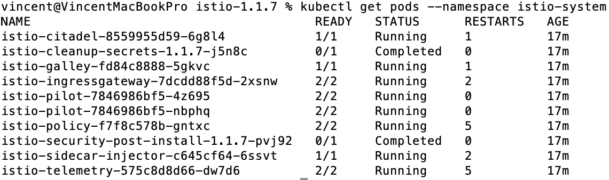

# Set up your demo environment

The following steps apply to Mac environment.

## Install Docker-destop with Kubernetes enabled.

Find the tutorial [here](https://docs.docker.com/docker-for-mac/install/).

Allocate enough CPUs and memories to docker. I assigned 6 CPUs and 8G memory.

## Install Istio as prerequisite

Although Knative Serving supports multiple networking dependencies, Serving Operator currently still ask you
to install Istio as a prerequisite.

### Install Helm:

```aidl
brew install kubernetes-helm
```

To upgrade Helm:

```aidl
brew upgrade kubernetes-helm
```

### Download Istio and install CRDs

```aidl
export ISTIO_VERSION=1.1.7
curl -L https://git.io/getLatestIstio | sh -
cd istio-${ISTIO_VERSION}
for i in install/kubernetes/helm/istio-init/files/crd*yaml; do kubectl apply -f $i; done
```

### Create istio-system namespace

There is a YAML file you can use to install the namespace for istio. If you have download this repository,
run the following commands:

```
cd demo-knative-operators
kubectl apply -f knative-serving-operator/dependencies/istio-namespace.yaml
```

Or directly apply the following command:

```aidl
cat <<EOF | kubectl apply -f -
apiVersion: v1
kind: Namespace
metadata:
  name: istio-system
  labels:
    istio-injection: disabled
EOF
```

### Installing Istio with SDS to secure the ingress gateway

Go back to the directory of istio-${ISTIO_VERSION}, and run the next commands:
```aidl
helm template --namespace=istio-system \
  --set sidecarInjectorWebhook.enabled=true \
  --set sidecarInjectorWebhook.enableNamespacesByDefault=true \
  --set global.proxy.autoInject=disabled \
  --set global.disablePolicyChecks=true \
  --set prometheus.enabled=false \
  `# Disable mixer prometheus adapter to remove istio default metrics.` \
  --set mixer.adapters.prometheus.enabled=false \
  `# Disable mixer policy check, since in our template we set no policy.` \
  --set global.disablePolicyChecks=true \
  --set gateways.istio-ingressgateway.autoscaleMin=1 \
  --set gateways.istio-ingressgateway.autoscaleMax=2 \
  --set gateways.istio-ingressgateway.resources.requests.cpu=500m \
  --set gateways.istio-ingressgateway.resources.requests.memory=256Mi \
  `# Enable SDS in the gateway to allow dynamically configuring TLS of gateway.` \
  --set gateways.istio-ingressgateway.sds.enabled=true \
  `# More pilot replicas for better scale` \
  --set pilot.autoscaleMin=2 \
  `# Set pilot trace sampling to 100%` \
  --set pilot.traceSampling=100 \
  install/kubernetes/helm/istio \
  > ./istio.yaml

  kubectl apply -f istio.yaml
```

### Verifying your Istio install

```aidl
kubectl get pods --namespace istio-system
```

If istio is installed correctly, we should be able to see the following information:


The flag -w can be added to the kubectl get commands to view the pod status in realtime.
