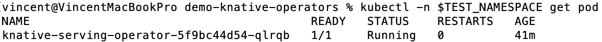
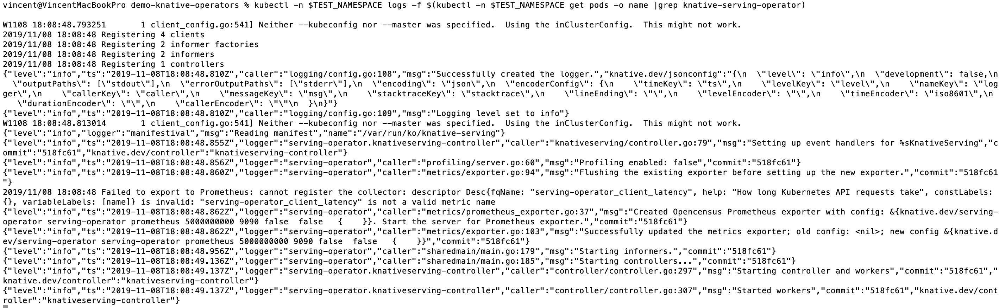
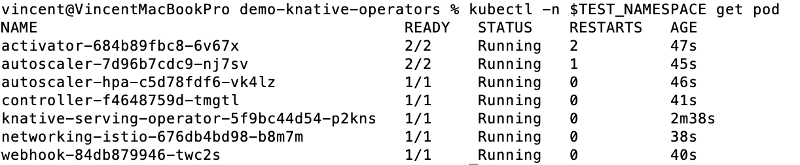
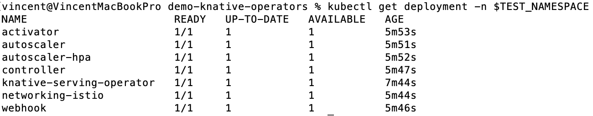
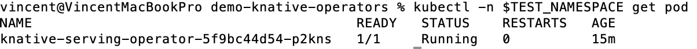

# Demo of basic features for Knative Serving Operator

You can find the official released artifacts of Knative Serving Operator at the [release page](https://github.com/knative/serving-operator/releases).
The latest release is v0.10.0.

## Create a test namespace for serving operator

We use the namespace test-serving.

```aidl
kubectl create namespace test-serving
```

## Install Serving Operator

You can choose to install Serving Operator either from the latest released or from the source code.

### Install current release

Set an environment variable as the test namespace:
```aidl
export TEST_NAMESPACE=test-serving
```

The current release of Serving Operator is v0.10.0. You can run:

```aidl
kubectl -n $TEST_NAMESPACE apply -f https://github.com/knative/serving-operator/releases/download/v0.10.0/serving-operator.yaml
```

### Verify the installation of Serving Operator

Run the following command to see the operator pod:

```aidl
kubectl -n $TEST_NAMESPACE get pod
```

You can expect to see:



Check the log of the pod:
```aidl
kubectl -n $TEST_NAMESPACE logs -f $(kubectl -n $TEST_NAMESPACE get pods -o name |grep knative-serving-operator)
```

We expect there is only one pod running. If not, you need to use the specific pod name after -f flag.
You can expect to see:



### Verify the operator CRD

Run the following command to check the new operator CRD installed:

```aidl
kubectl describe crd knativeservings.operator.knative.dev
```

## Install Serving by creating operator custom resource

The CR of serving operator controls everything. When CR is created, the serving will be installed. The
YAML file [example-serving-cr.yaml](example-serving-cr.yaml) is for you to use.

Go to the home directory of this repository, and run:
```aidl
kubectl -n $TEST_NAMESPACE apply -f knative-serving-operator/basic-functionalities/example-serving-cr.yaml
```

You will see all the serving pods running, with the command `kubectl -n $TEST_NAMESPACE get pod`:



Check the operator CR by running the following command:

```aidl
kubectl describe KnativeServing -n $TEST_NAMESPACE
```

## Restore the deployments of serving

As you can see there are multiple deployments of serving install. When you run the command:

```aidl
kubectl get deployment -n $TEST_NAMESPACE -w
```

You will see all of them:



We pick up one of them, e.g. activator. Kill it manually with the command:

```aidl
kubectl delete deployment activator -n $TEST_NAMESPACE
```

The deployment can be revived very fast. When you check the deployments of serving again, you can still see
the deployment `activator` still available.

## Uninstall Serving by deleting operator custom resource

When CR is removed, the serving will be removed. The
YAML file [example-serving-cr.yaml](example-serving-cr.yaml) is for you to use.

Go to the home directory of this repository, and run:
```aidl
kubectl -n $TEST_NAMESPACE delete -f knative-serving-operator/basic-functionalities/example-serving-cr.yaml
```

You will see all the serving pods are gone, when running `kubectl -n $TEST_NAMESPACE get pod`. Only the operator
pod is left.



## Remove Serving Operator

You can run the following command to delete the Serving Operator:

```aidl
kubectl -n $TEST_NAMESPACE delete -f https://github.com/knative/serving-operator/releases/download/v0.10.0/serving-operator.yaml
```
